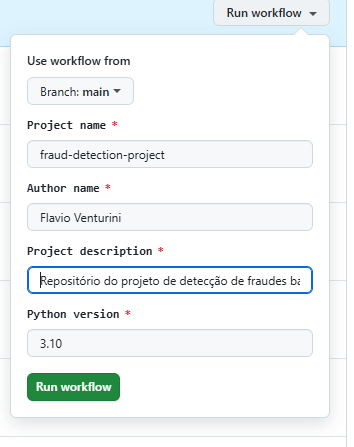
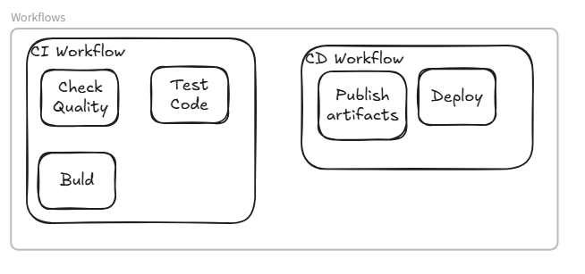

# ML Project Scaffold

Este é um scaffold para projetos de Machine Learning, criado para fornecer uma estrutura inicial padronizada e robusta para novos projetos de ML. Ele utiliza o Cookiecutter para gerar um novo projeto com uma estrutura de diretórios predefinida, arquivos de configuração e exemplos de código.

## Inicio da jornada

A criação de um novo projeto é feito através do workflows Create Scaffold Repository no GitHub Actions.

O workflow cria um novo repositório no GitHub com o nome do projeto e inicializa o repositório com os arquivos gerados pelo Cookiecutter.
O workflow também copia variáveis e secrets necessárias para o funcionamento do projeto na Cloud.

O repositório criado contém actions que são trigadas a partir de eventos do Github.
- O push na branch main dispara o workflow de CI e CD. 
- O push nas outras branchs dispara somente o workflow de CI.

